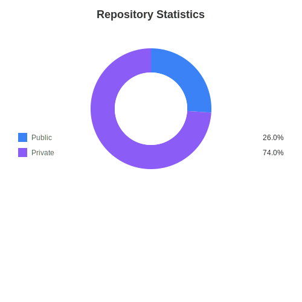
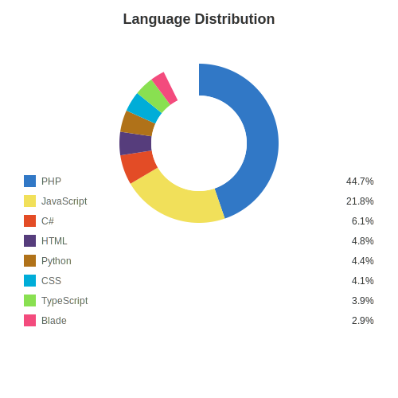
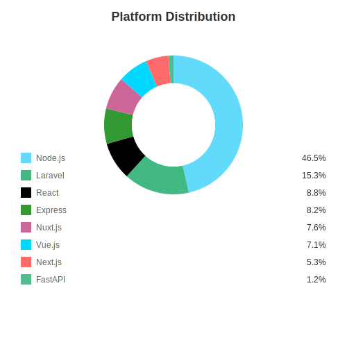
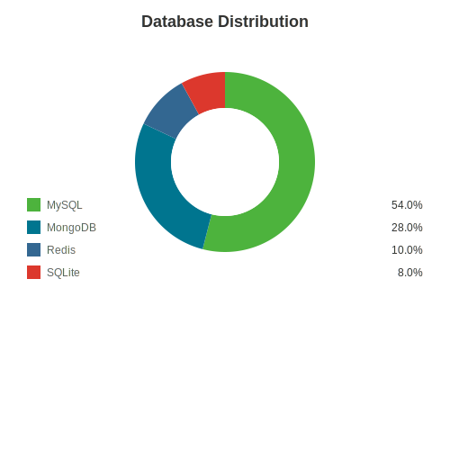
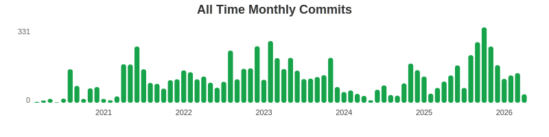

<!-- PROFILE INTRO: concise, recruiter-friendly, and non-disruptive to current employer -->

  <strong>Senior Full‑Stack Engineer PHP · Node.js · TypeScript · Flutter · Nuxt.js/Next.js ·  Cloudflare & AWS · Docker · Github Action CI/CD</strong>

## Hi there 👋

 I maintain a broad codebase with steady contributions across backend systems, web platforms, mobile platforms, and data-driven services.
 
 My work focuses on pragmatic engineering: shipping reliable, maintainable systems, improving observability, and mentoring teams. 
 
 I currently work extensively with TypeScript, Flutter, Node.js, Nuxt.js, Next.js, Cloudflare (DNS/Pages/Workers), AWS, Docker, and MongoDB.
 
 My past experiences shown here as key signals from this profile: PHP (52.9%), Node.js ecosystem (46.5%), and MySQL (53.2%).

Email: aminusia@gmail.com

LinkedIn: https://www.linkedin.com/in/andi-suryono/

---
<i>I am passionate about creating amazing things with code!</i>
---

### 🚀 About This Profile

This profile automatically updates weekly with statistics about my repositories and coding languages. The automation is powered by TypeScript and GitHub Actions.

Want to create your own? Check out the [documentation](DOCUMENTATION.md) to learn how!

<!-- STATS:START -->
## 📊 GitHub Statistics

### Repository Overview

**Total Repositories:** 128 | **Public:** 32 | **Private:** 96

  

### 💻 Programming Languages

  

### 🚀 Frameworks & Platforms

  

### 🗄️ Databases

  

### 📈 Activities

  

*Last updated: Sun, 11 Jan 2026 00:12:29 GMT*

<!-- STATS:END -->